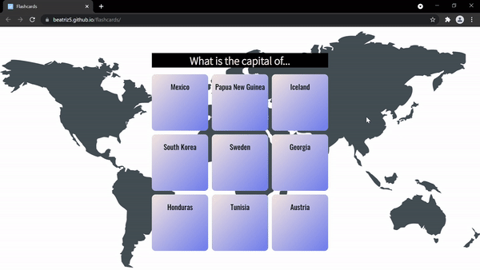

# Flashcards

A stylized page with flashcards, each containing a question on one side and the answer on the other. Hover on the flashcard and the answer will reveal itself. On the front a country on the back its capital.

## Demonstration

https://beatriz5.github.io/flashcards/

## Built With

* HTML + CSS
* Webstorm 2021.1.1
* Visual Studio Code

## Author

* Beatriz https://github.com/beatriz5

## Acknowledgments

https://codepen.io/ryandsouza13/pen/aemxOQ

https://github.com/PV-COP/PV-README-TEMPLATE/blob/master/TemplateWithInfo.md

https://ezgif.com/
